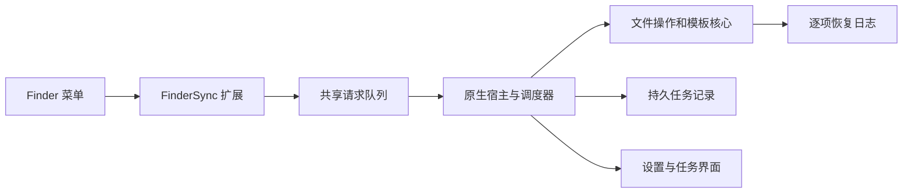

# RightMouse

原生 macOS Finder 右键效率工具，使用 SwiftUI、AppKit 和 FinderSync 实现。当前是开发版本：已有宿主、真实 Finder 扩展与文件操作引擎，系统接入与发布验收仍在进行。

## 开发与验证

在 macOS 安装 Command Line Tools 后运行：

```sh
scripts/check-core.sh
scripts/build-app.sh
open .build/native/RightMouse.app
```

核心检查使用随机临时目录，覆盖命令协议、配置、模板、菜单和文件操作。NSFileCoordinator 需要可访问系统文件协调服务；受限执行环境中的连接失败不能视为文件测试通过。

脚本生成的 ad-hoc 开发版会实际检查共享容器的读写能力。共享容器不可用时，宿主使用 Application Support 下独立的 `RightMouse-Development` 目录，并常驻提示 Finder 菜单暂不可用；可以继续在应用内的文件操作台使用本地功能。正式签名构建与 Finder 扩展不允许此降级。`RIGHTMOUSE_DATA_DIR` 仅供带开发标志的宿主使用，测试工具通过显式临时目录注入存储。

启动存储修复的历史验证见 [启动存储记录](Config/validation/development-storage-fallback-2026-09-23.md)；最新构建的检查结果与校验值见下文的工作流集成证据。

`scripts/package-app.sh --development` 生成开发 ZIP。完整 Xcode 工程为 `RightMouse.xcodeproj`；新增 Swift 文件后运行 `python3 Config/generate-project.py`。标准 XCTest 和正式签名步骤见 [构建说明](Config/README.md)。

## 当前能力

- 新建 TXT、Markdown、JSON、YAML、HTML、Shell 文件，导入自定义模板。
- 复制路径、名称、无扩展名名称和 Shell 引用格式。
- 剪切会话、粘贴移动、复制到和移动到指定目录。
- 重名时跳过或保留两份，可应用于本批后续冲突；等待选择时保留进度，取消保留已完成项目。
- 最近目标保留 10 项，使用安全书签及目录身份核对；支持修复、移除与清空记录。
- 收藏目录、Terminal、VS Code 与自定义应用入口；VS Code 跨目录选择先指定一个项目目录。
- 菜单开关、排序、分组、预览、任务进度与恢复核对界面。
- 液态玻璃导航与预览，主窗口默认 960×680 pt，在当前屏幕居中；旧系统与减少透明度模式提供材质降级。

首次使用需在应用中选择使用目录，并在系统扩展设置中确认 Finder 扩展状态。扩展仅对配置目录提供菜单。目录授权来自系统选择器；配置中的路径文字本身不代表授权。

## 实现结构



扩展捕获每次菜单的独立上下文，入队并唤醒宿主；宿主验证请求、授权范围和重复请求，再串行执行文件变更。操作记录不完整时要求核对，不自动重新执行。恢复页中的人工确认只保存核对记录，不删除文件，也不把原来的失败改写为成功。

## 当前验证边界

150 项核心夹具检查、168 项宿主侧检查通过（153 项真实宿主断言及 15 项打开方式规划断言），详情及最新开发包校验值见 [工作流集成证据](specs/001-finder-core/evidence/EV-workflows-001.md)。撤销与重试的早期验证见 [恢复证据](specs/001-finder-core/evidence/EV-followup-hardening-001.md)。宿主与嵌入扩展已实际编译，开发签名结构验证通过；Finder 登记和进程加载证据见 [接入记录](Config/validation/finder-load-2026-09-22.md)。后续系统日志已确认当前 ad-hoc 构建的 App Group 访问被拒绝，路径查找成功不代表共享通信可用。

尚未完整通过：真实 Finder 菜单到宿主的端到端操作、所有权限撤回场景、真实双卷/外置卷故障、最低 macOS 版本、完整键盘与 VoiceOver 验收、Developer ID 签名及公证。当前机器没有有效分发证书，也未安装完整 Xcode。开发包不等于已公证发行版。

[优化菜单规则历史基准](docs/sdd/evidence/menu-policy-benchmark/README.md) 保留三种场景各 100 次的原始样本和对应源码摘要；该轮纯规则 P95 为 1.955 / 4.104 / 0.169 ms，不包含真实 Finder 与 NSMenu 构造，也不作为新增最近目标菜单的性能结果。

## 规格与版本管理

- [设计方案](docs/design-plan.md)
- [SDD 索引](docs/sdd/README.md)
- [施工任务与进度](specs/001-finder-core/tasks.md)
- [验收清单](specs/001-finder-core/checklists/acceptance.md)

按可验证里程碑提交 Git：规格基线、核心与回归检查、原生宿主与扩展、接入修复、验收和发行。每次提交保留对应证据；未完成的验收保持未完成。
