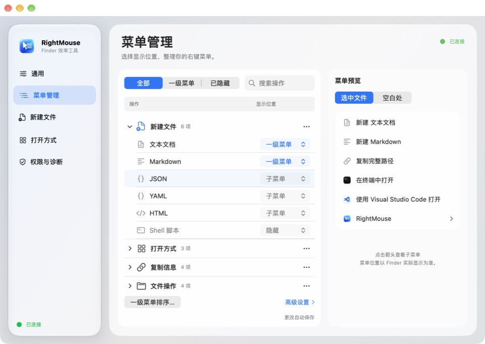

# RightMouse

一款原生 macOS Finder 右键增强工具，把新建文件、复制路径、剪切移动和常用应用入口放进右键菜单。使用 SwiftUI、AppKit 和 FinderSync 构建，采用液态玻璃风格界面。



## 功能

- **新建文件**：内置 TXT、Markdown、JSON、YAML、HTML、Shell 模板，支持导入自定义模板。
- **复制信息**：复制完整路径、文件名、不含扩展名的名称，以及适用于终端的转义路径。
- **文件操作**：剪切后粘贴移动，或直接选择目录进行复制、移动；遇到同名文件时询问处理方式。
- **打开方式**：在终端、VS Code 或自定义应用中打开文件与目录。
- **自定义菜单**：为每个操作选择「一级菜单 / 子菜单 / 隐藏」，支持搜索、批量设置、排序和分层预览。

## 安装

当前提供 **0.2.0 本机预览版**，包含 Apple Silicon（arm64）和 Intel（x86_64）安装包。最低编译目标为 macOS 14；两个架构已通过 macOS 26 自动构建与检查，真实 Finder 交互在 macOS 27 上完成本机验证。

1. 从 [发行版页面](https://github.com/sephiroth233/right-mouse/releases) 下载适合你的 Mac 的 DMG（M 系列选 `arm64`，Intel 选 `x86_64`），打开后将 **RightMouse.app** 拖入 **Applications（应用程序）**。
2. 打开 RightMouse。当前版本未经过 Apple 公证；若系统阻止启动，可在「系统设置 → 隐私与安全性」中选择「仍要打开」。
3. 在应用的「权限与诊断」中打开扩展设置，启用 **RightMouse Finder 扩展**。
4. 确认应用显示「已连接」，在 Finder 的普通本地文件夹中右键即可使用。在「菜单管理」中调整常用操作的位置。

使用本机版不需要 Apple Developer 账号。首次安装会自动配置当前用户的本机连接服务。

无法打开、右键菜单未出现，以及升级和卸载步骤，见 [安装与使用说明](docs/local-install.md)。

## 从源码构建

在 macOS 上安装 Xcode Command Line Tools 和 Python 3，然后在仓库根目录运行：

```bash
python3 scripts/build-local-app.py
scripts/package-local-app.sh --no-build
```

生成的 DMG 位于 `dist/`。构建会为本机组件生成签名身份，无需开发者账号；生成的安装包仍属于未公证版本。

## 自动构建

GitHub Actions 在推送到 `main`、提交 PR 或手动触发时运行检查，分别构建 Apple Silicon 和 Intel DMG。推送 `v*` 版本标签后，通过检查的安装包会自动发布到 **Releases（发行版）**。日常构建仍可在 Actions 的 Artifacts 中下载。详见 [自动构建说明](docs/ci.md)。

## 开发文档

- [构建与签名配置](Config/README.md)
- [设计方案](docs/design-plan.md)
- [SDD 规格与施工文档](docs/sdd/README.md)
- [当前版本验收记录](specs/001-finder-core/evidence/EV-menu-editor-001.md)
