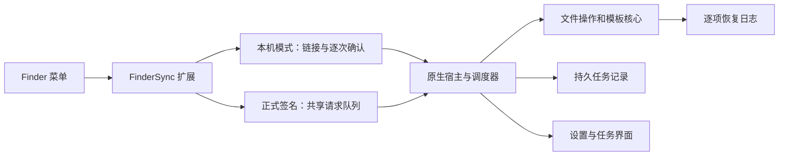

# RightMouse

原生 macOS Finder 右键效率工具，使用 SwiftUI、AppKit 和 FinderSync 实现。当前是开发版本：已有宿主、真实 Finder 扩展与文件操作引擎，系统接入与发布验收仍在进行。


无开发者账号的本机预览版已接入签名校验的 XPC 通道。构建与打包使用 `python3 scripts/build-local-app.py` 和 `scripts/package-local-app.sh --no-build`，产物为 `dist/RightMouse-0.2.0-local-<架构>.dmg`。首次安装、升级和卸载见 [本机版安装说明](docs/local-install.md)，通信与验收约束见 [XPC 施工契约](specs/001-finder-core/contracts/local-xpc.md)。本机版已支持自定义模板、打开方式、手动选择复制/移动目标和剪切粘贴的 Finder 菜单；主界面仅保留通用、菜单管理、新建文件、打开方式、权限与诊断五个设置入口。本机版不使用 App Group，也未经过 Apple 公证；原来的开发 ZIP 与 Developer ID 公证路线仍保留。

## 目录

- [开发与验证](#开发与验证)
- [当前能力](#当前能力)
- [实现结构](#实现结构)
- [当前验证边界](#当前验证边界)
- [规格与版本管理](#规格与版本管理)
- [参考](#参考)

## 开发与验证

在 macOS 安装 Command Line Tools 后运行：

```sh
scripts/check-core.sh
scripts/build-app.sh
open .build/native/RightMouse.app
```

核心检查使用随机临时目录，覆盖命令协议、配置、模板、菜单和文件操作。NSFileCoordinator 需要可访问系统文件协调服务；受限执行环境中的连接失败不能视为文件测试通过。

脚本生成的 ad-hoc 开发版采用本机 Finder 模式，不依赖 App Group。宿主使用 Application Support 下独立的 `RightMouse-Development` 目录；扩展保留沙盒，提供固定的内置菜单，文件操作通过本机链接进入宿主逐次确认。此旧开发通道仅用于有限调试；完整自定义菜单与剪切粘贴请使用本机 XPC 发行构建。正式签名版继续使用共享队列，不接受本机链接入口。`RIGHTMOUSE_DATA_DIR` 仅供带开发标志的宿主使用。

启动存储修复的历史验证见 [启动存储记录](Config/validation/development-storage-fallback-2026-09-23.md)；功能检查见[剪切与协议验证](specs/001-finder-core/evidence/EV-clipboard-protocol-001.md)，窗口滚动修复见[界面修复记录](specs/001-finder-core/evidence/EV-liquid-glass-001.md#5-固定窗口与右侧滚动)；最新本机 Finder 链路与构建见[本机模式验收](specs/001-finder-core/evidence/EV-local-finder-001.md)。

`scripts/package-app.sh --development` 生成开发 ZIP。完整 Xcode 工程为 `RightMouse.xcodeproj`；新增 Swift 文件后运行 `python3 Config/generate-project.py`。标准 XCTest 和正式签名步骤见 [构建说明](Config/README.md)。

## 当前能力

- 新建 TXT、Markdown、JSON、YAML、HTML、Shell 文件，导入自定义模板。
- 复制路径、名称、无扩展名名称和 Shell 引用格式。
- 剪切会话、粘贴移动、复制到和移动到指定目录。
- 每次新操作遇到重名均询问，可选择跳过或保留两份，并应用于本批后续冲突；等待选择时保留进度，取消保留已完成项目。
- 点击“复制到…”或“移动到…”直接选择目标目录；侧栏及右键菜单不再展示常用目录或最近目标。旧记录保留兼容，不自动恢复菜单入口。
- Terminal、VS Code 与自定义应用入口；VS Code 跨目录选择先指定一个项目目录。
- 菜单开关、排序、分组与预览；侧栏已移除“任务记录”和“文件操作”，执行进度与恢复核对通过独立文件任务窗口提供。
- 脱敏诊断事件保留 7 天或 10 MiB，支持主动导出；证据完整的过期终态记录按 30 天策略清理，恢复证据继续保留。
- 权限、空间、卷状态与来源变化使用独立错误码；不可重试项禁止直接重试。
- 首次引导可在选定目录完成 TXT 创建演练，以真实任务回执确认结果并定位文件。
- 完整配置、书签、模板和操作记录保存在宿主私有目录；Finder 只读取菜单显示快照。旧布局支持同卷原子迁移，冲突时保留现场。
- 损坏操作记录保留原件并生成受容量限制的去重原始副本；核对页展示暂存占用，对归属和授权均有效的孤立暂存提供显式清理。
- 复制、移动及撤销提交后再次核对对象；跨卷来源先隔离再验证清理，异常时在恢复页显示保留副本位置。
- 独立品牌应用图标、统一功能符号与 Terminal/VS Code 应用小图标，覆盖设置页及 Finder 菜单。
- 菜单编辑器提供逐项显示位置、分类折叠、搜索筛选、批量设置与一级排序；预览按真实层级浏览。
- 液态玻璃导航与预览，主窗口默认 960×680 pt，在当前屏幕居中；旧系统与减少透明度模式提供材质降级。

首次使用需在系统设置中启用 Finder 扩展。本机模式的菜单覆盖普通本地目录与挂载卷；共享模式需在应用中选择使用目录，扩展仅对配置目录提供菜单。目录授权来自系统选择器；配置中的路径文字本身不代表授权。

## 实现结构



共享模式中，扩展捕获每次菜单的独立上下文，入队并唤醒宿主；宿主验证请求、授权范围和重复请求，再串行执行文件变更。操作记录不完整时要求核对，不自动重新执行。恢复页中的人工确认只保存核对记录，不删除文件，也不把原来的失败改写为成功。

## 当前验证边界

当前可视化菜单编辑版本通过 384 项核心、472 项宿主与 18 项真实 XPC 检查；实际 Finder 菜单、界面及 DMG 安装验证见[菜单管理验收](specs/001-finder-core/evidence/EV-menu-editor-001.md)。历史 341 项核心夹具检查、408 项宿主侧检查通过，最新宿主回归见[剪切与协议验证](specs/001-finder-core/evidence/EV-clipboard-protocol-001.md)，核心证据见[来源隔离修复](specs/001-finder-core/evidence/EV-source-isolation-001.md)。另有 15 项[真实 APFS 双卷检查](specs/001-finder-core/evidence/EV-real-volume-001.md)通过，包括跨卷复制/移动、元数据、取消保源和真实 ENOSPC。宿主与嵌入扩展已实际编译，开发签名结构验证通过；Finder 登记和进程加载证据见[接入记录](Config/validation/finder-load-2026-09-22.md)。此前系统日志确认 ad-hoc 的 App Group 访问被拒绝；最新本机模式已移除该依赖，真实 Finder 菜单 → 宿主确认 → TXT 创建及同名保留、冷启动已取得证据，见[本机模式验收](specs/001-finder-core/evidence/EV-local-finder-001.md)。

尚未完整通过：真实 Finder 全部上下文及操作矩阵、所有权限撤回场景、外置卷拔出及其他文件系统、最低 macOS 版本、完整键盘与 VoiceOver 验收、Developer ID 签名及公证。当前机器没有有效分发证书，也未安装完整 Xcode。隔离 APFS 镜像通过不等于外置设备故障通过，开发包不等于已公证发行版。

本轮已接入孤立暂存显式清理、首次创建演练、宿主私有存储分层及损坏日志保全副本；实现状态与剩余验收见[V1 实现差距](specs/001-finder-core/evidence/EV-implementation-gaps-001.md)。保留策略对撤销、旧暂存及不完整证据继续采取保守保留，未将整项系统验收标为完成。

[最新菜单快照基准](docs/sdd/evidence/menu-policy-benchmark/2026-09-23-menu-snapshot-recent/README.md)使用 10 项最近目标，三种场景各保留 100 次原始样本，纯规则 P95 为 6.058 / 8.016 / 0.519 ms；不含真实 Finder、NSMenu、读盘或 IPC。[历史样本](docs/sdd/evidence/menu-policy-benchmark/README.md)保留，因输入不同不直接判定性能变化。

## 规格与版本管理

- [设计方案](docs/design-plan.md)
- [SDD 索引](docs/sdd/README.md)
- [施工任务与进度](specs/001-finder-core/tasks.md)
- [验收清单](specs/001-finder-core/checklists/acceptance.md)

按可验证里程碑提交 Git：规格基线、核心与回归检查、原生宿主与扩展、接入修复、验收和发行。每次提交保留对应证据；未完成的验收保持未完成。

## 参考

- [品牌与菜单图标验证](specs/001-finder-core/evidence/EV-app-icons-001.md)
- [本机 Finder 模式及最新验收](specs/001-finder-core/evidence/EV-local-finder-001.md)
- [最新剪切与协议验证](specs/001-finder-core/evidence/EV-clipboard-protocol-001.md)
- [构建与签名配置](Config/README.md)
- [完整需求规格](specs/001-finder-core/spec.md)
