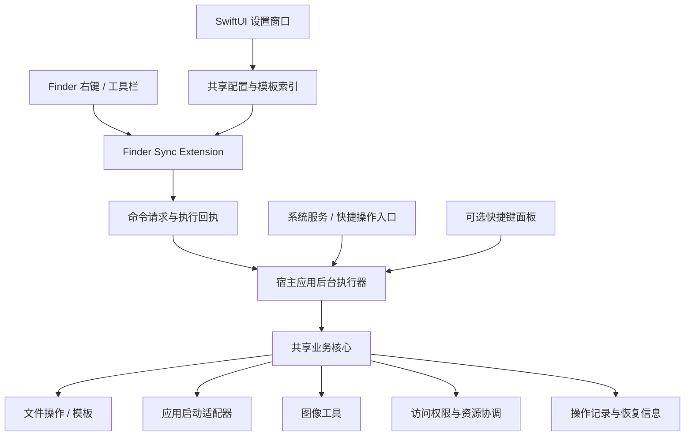

# RightMouse 核心功能复刻设计方案

日期：2026-09-22。状态：设计提案，尚未实施或进行真机验证。

后续施工基线见 [SDD 施工文档入口](sdd/README.md)。V1 的具体行为、接口、任务和验收以该规格包为准；本文保留为产品设计背景。

## 1. 产品目标与设计前提

做一个中文优先、原生、轻量的 macOS Finder 效率工具。用户在文件或目录上右键，即可新建文件、复制路径、移动文件、打开开发工具和访问常用目录。

功能参照「超级右键专业版」公开说明，使用独立名称、界面与素材。当前仓库为空，可以从原生工程开始。本方案默认先交付可独立安装的 macOS 应用；Mac App Store 版本作为后续独立评估项。

建议最低系统版本为 macOS 14，优先适配 Apple Silicon。Intel 支持取决于选定 Xcode/SDK 的构建能力和实机覆盖，在验证前不作为已承诺能力。最低版本是项目建议，不代表竞品系统要求。

本方案基于 App Store、厂商帮助和 Apple 开发文档的案头研究，未安装或实际操作竞品，不声称掌握其内部实现。

竞品公开功能包括新建文件、复制/发送文件、常用目录、剪切粘贴、复制路径、指定应用打开、图片转换、文件信息，以及翻译、二维码和其他软件联动。[竞品公开功能](https://apps.apple.com/cn/app/id1550403011?mt=12)

## 2. 版本范围

| 版本 | 功能 | 交付边界 |
| --- | --- | --- |
| 技术验证 | Finder 菜单、当前目录与选中项、后台唤醒、文件权限 | 在真实 Finder 中完成“新建 TXT”和“复制路径”；覆盖主程序冷启动 |
| V1 核心 | 新建文件 | TXT、Markdown、JSON、YAML、HTML、Shell；导入用户模板 |
| V1 核心 | 复制路径/名称 | 完整路径、文件名、无扩展名名称；多选逐行输出；终端转义路径单独提供 |
| V1 核心 | 剪切/粘贴 | 在本应用菜单内闭环；多文件、重名、跨磁盘、部分失败 |
| V1 核心 | 复制到/移动到 | 常用目标、临时选目录、记住最近目标 |
| V1 核心 | 在应用中打开 | Terminal、VS Code；其他应用通过选择 .app 添加，按适配能力开放 |
| V1 核心 | 常用目录 | 添加、排序、改名、直接在 Finder 打开 |
| V1 核心 | 菜单配置与诊断 | 启停、排序、分组、场景预览、扩展和权限状态 |
| V1.1 增强 | 文件整理 | 按文件名建文件夹、文件隐藏属性、创建桌面替身、文件信息与哈希 |
| V1.1 增强 | 图片工具 | PNG/JPEG/HEIC 输出、缩放；可选 WebP、ICNS、图标集 |
| V1.1 增强 | 云盘兼容入口 | Finder 工具栏、系统服务、快捷键面板；逐个系统和云盘实测 |
| V1.2 可选 | 扩展工具 | ZIP、解散文件夹、文件夹图标、二维码、更多终端和编辑器适配 |
| 后续按需 | 外部服务与联动 | 翻译、截图软件、压缩软件联动、手势触发 |

基础云盘边界在技术验证阶段调查；V1.1 负责将备用入口做成完整体验。V1 不宣称云盘里原生右键与普通目录完全一致。

Office、Pages、PSD 等格式采用有效模板复制，不能只创建一个空文件再加后缀。初版内置文本模板，复杂格式优先允许用户导入自己创建的模板。

## 3. 交互方案

### 3.1 Finder 是主操作界面

空白处右键的功能布局建议：

```text
新建文件                  ▸
在此处打开                ▸
粘贴待移动文件（3 项）
常用目录                  ▸
RightMouse 工具            ▸
```

选中文件时的功能布局建议：

```text
复制路径
剪切文件
复制到                    ▸
移动到                    ▸
打开方式                  ▸
RightMouse 工具            ▸
```

这些是扩展内部的逻辑布局。最终所在位置和系统菜单排序由 Finder 控制，不承诺插入到某个系统菜单项之前。

规则：

- 默认只展开高频操作，提供“紧凑模式”将全部操作收进一个子菜单。
- 空白处操作当前目录；选中目录的“在此处打开”操作该目录；选中文件的终端操作其父目录。
- 搜索结果、最近使用等虚拟位置如果没有明确写入目录，禁用新建和粘贴并提供选择目标目录的入口。
- 多选跨目录文件时，终端操作先让用户选择一个目标目录；禁止静默打开大量终端窗口。
- 图片转换仅对支持的图片类型出现；混合选中时明确显示可处理数量。
- 长任务立即返回 Finder，通过状态窗口展示进度、取消和逐项失败信息。
- 小操作成功不反复弹窗；新建文件完成后定位文件，重命名体验在验证后决定采用原生选中还是轻量命名窗口。

### 3.2 设置窗口

按 2026-09-22 用户补充要求，原生 SwiftUI 窗口采用液态玻璃风格，主窗口默认外框 960 × 680 pt；启动与关闭重开时，在鼠标所在屏幕的可用区域几何居中，避开菜单栏和 Dock。小屏自动缩小并保留 24 pt 外边距，窗口可手动调整；已显示窗口不会因切页或激活被重新居中。

左侧为 204 pt 玻璃导航面板，右侧为柔和圆角内容区，页内内容设宽度上限后居中，避免大屏表单无限拉伸。macOS 26 及以上使用 SwiftUI 原生 `glassEffect`，macOS 14/15 使用系统磨砂材质；减少透明度或增强对比度时使用实色面板。玻璃主要用于导航与菜单预览，文本与文件任务保留稳定阅读底色。[Apple 自定义 Liquid Glass 指南](https://developer.apple.com/documentation/swiftui/applying-liquid-glass-to-custom-views)

```text
┌─────────────────────────────────────────────────────┐
│ RightMouse                                          │
├──────────────┬──────────────────────────────────────┤
│ 通用         │ 菜单管理                 [紧凑模式]  │
│ 菜单管理     │                                      │
│ 新建文件     │ 启用  功能            适用场景       │
│ 常用目录     │  ✓   新建文件         当前目录       │
│ 打开方式     │  ✓   复制路径         文件/目录      │
│ 文件操作     │  ✓   剪切/粘贴        文件/目录      │
│ 工具箱       │                                      │
│ 权限与诊断   │ [添加分组]  [恢复默认]   菜单预览    │
└──────────────┴──────────────────────────────────────┘
```

“新建文件”管理模板、默认文件名和创建后行为；“打开方式”管理应用及文件/目录支持能力；“文件操作”管理冲突策略；“权限与诊断”显示扩展、授权、后台启动、失效目录和最近错误。

### 3.3 首次启动

1. 用一页说明三项主要能力：新建、移动、打开工具。
2. 检查并引导用户启用 Finder 扩展，按系统版本显示正确入口。
3. 选择需要使用的目录，说明“菜单覆盖”和“文件读写权限”是不同状态。
4. 在用户指定的测试目录完成一次新建 TXT，反馈是否成功。
5. 默认开启少量菜单，其他功能按需开启。

菜单栏图标可关闭；设置入口保留在应用和 RightMouse 子菜单中。开机启动由用户选择，与单次命令冷启动分开处理。

## 4. 技术架构



### 4.1 模块与选型

| 模块 | 建议技术 | 责任 |
| --- | --- | --- |
| 宿主应用 | Swift + SwiftUI，必要时 AppKit | 设置、授权、任务窗口、命令执行 |
| Finder 扩展 | FinderSync + AppKit NSMenu | 获取上下文、构建菜单、派发命令 |
| 共享核心 | 本地 Swift Package | 菜单规则、模板、文件操作、数据模型 |
| 配置共享 | App Group + 小型版本化配置文件/UserDefaults | 扩展只读缓存；宿主统一修改 |
| 文件操作 | Foundation，按需 NSFileCoordinator | 复制、移动、协调读写、错误归类 |
| 应用启动 | NSWorkspace + 每个应用独立适配器 | 普通文件打开、项目打开、终端工作目录 |
| 图片处理 | ImageIO / CoreGraphics | 编解码、缩放、方向和透明度处理 |
| 操作记录 | 宿主单写 JSON 日志；规模扩大后用 SQLite | 状态、冲突、部分完成、恢复 |

Apple 文档提供 Finder Sync 上下文菜单和工具栏入口，但也明确其设计用途主要是同步软件，不是通用 Finder 界面修改框架。这里将它作为需验证的接入技术，长期保留替代入口。[Finder Sync 官方说明](https://developer.apple.com/library/archive/documentation/General/Conceptual/ExtensibilityPG/Finder.html)

### 4.2 扩展与宿主通信

技术验证首选“App Group 内原子写入请求 + 唤醒宿主 + 回执”的小型协议；XPC 作为验证后可替换实现，不在未测试签名、沙盒和启动行为前假定必定可用。

请求包括 commandID、requestID、创建时间、来源场景、文件引用、目标目录引用和必要选项。宿主负责白名单校验、去重、过期拒绝和操作前再次检查。若使用自定义 URL Scheme 唤醒，只传随机请求 ID；URL 不携带文件操作参数，不能作为直接执行任意路径操作的接口。

共享配置不等于共享文件访问权限，文件路径字符串也不构成授权。持久目录授权由实际执行进程维护；扩展传来的文件引用在接收端验证访问能力，必要时让宿主取得用户授权。不能简单把某进程创建的 app-scoped bookmark 当成所有进程都能使用的通行证。[Apple 沙盒文件访问说明](https://developer.apple.com/documentation/security/accessing-files-from-the-macos-app-sandbox)

在菜单回调期间捕获目标和选中项，建立不可变上下文。执行器使用该上下文，不重新读取“此时前台的 Finder 窗口”。扩展不扫描文件树，不计算哈希，不在显示菜单时下载云文件。

### 4.3 核心数据模型

- MenuAction：稳定 ID、名称、分组、排序、启用状态、适用场景、允许类型、执行器类型。
- ActionContext：选择文件、当前目录、触发入口、选择数量、内容类型快照。
- Template：模板 ID、名称、实际模板资源、后缀、默认命名规则、可选文本变量。
- FavoriteLocation：目录引用、展示名、排序、可用状态。
- AppIntegration：bundle ID、应用引用、支持文件/目录、适配器类型、配置。
- PendingMove：待移动文件引用、记录时间、剪贴板标记、原文件身份信息。
- OperationRecord：请求 ID、逐项来源/目标、阶段、冲突策略、结果、错误、可恢复条件。

模板初版可选变量限定为日期和文件名等明确字段；二进制模板原样复制，不做字符串替换。

## 5. 核心功能行为

### 5.1 新建文件

先确认目标目录可写，再选择模板、生成唯一名称、复制有效内容，最后定位结果。重名默认递增编号，不覆盖。文本以 UTF-8 创建；JSON 默认使用有效的 `{}`。同时触发多个新建操作时使用排他创建或失败重试，不能只依赖“先检查是否存在”。

### 5.2 剪切与移动

剪切只建立待移动列表，不修改源文件，也不使用“隐藏文件”伪装剪切效果。采用自定义剪贴板类型并与文件引用关联；V1 只保证 RightMouse 的剪切/粘贴闭环，不承诺与 Finder 原生粘贴和快捷键完全互操作。

粘贴时重新验证来源、目标、权限和身份。源文件消失、被替换或剪贴板标记失效时提示具体原因，不执行旧路径操作。

- 同卷移动：优先使用文件系统移动能力；批量操作仍需逐项记录，不能宣称整批原子完成。
- 跨卷移动：复制到目标临时名称，校验复制结果和必要元数据，确认源在复制期间未变化后提交目标，最后删除源；目录逐项记录。
- 删除源失败：保留目标和来源，报告“已复制，源未删除”，不得误报完整移动成功。
- 目标重名：询问、跳过、保留两份；V1 不提供静默覆盖目录和自动目录合并。
- 中断恢复：记录复制、提交、删除各阶段；恢复前重新检查文件身份，不盲目重放删除步骤。
- 取消：停止后续项目；跨卷复制未提交时保留源，已经成功移动的项目单独列明。
- 撤销：只在文件身份、目标和原路径仍满足条件时提供反向移动；不承诺所有跨盘、云盘或部分失败操作都可撤销。

禁止将文件夹移入自身或后代；符号链接默认按链接处理，避免递归追踪导致循环。处理包目录、大小写差异、Unicode 文件名、磁盘空间不足和断开挂载。

### 5.3 在应用中打开

先用 NSWorkspace 按 URL 打开文件或目录。终端“以某目录为工作目录”和编辑器“作为项目打开”分别使用已验证的应用适配器；不能假设给任何 .app 传入目录都会产生同样效果。[NSWorkspace 打开接口](https://developer.apple.com/documentation/appkit/nsworkspace/open(_:withapplicationat:configuration:completionhandler:))

如果适配器需要 Apple Events，则在第一次使用时申请对应自动化权限。用结构化 URL/参数传递路径，处理空格、单引号、换行、中文等字符；不得将路径拼接成任意 shell 命令。V1 不提供任意脚本插件执行。

### 5.4 图片转换与其他工具

PNG/JPEG/HEIC 输出能力通过 ImageIO 在目标系统上查询并测试；WebP 单独评估编码器，不能将“支持读取”当成“支持写入”。[支持输出格式的查询接口](https://developer.apple.com/documentation/imageio/cgimagedestinationcopytypeidentifiers())

批处理输出新文件，保留原图；提供 JPEG 背景色与质量，处理方向、色彩空间、透明度和元数据。大图采用尺寸限制及后台处理。图标集规格以实施时的 Apple 平台要求为准，不照搬竞品旧尺寸清单。

文件哈希用分块流式读取，取消时停止后续读取。解散文件夹属于后续功能：先生成计划、解决重名、移动成功后确认目录为空，最后移入废纸篓；任何子项失败都保留源目录。

## 6. 系统兼容与权限

### 6.1 Finder 覆盖边界

| 位置 | 设计处理 |
| --- | --- |
| 普通本地目录 | V1 主支持范围，按配置注册并验证菜单 |
| 桌面/文稿 | 区分本地目录与开启 iCloud 同步的目录 |
| 外置磁盘 | 挂载后刷新覆盖；拔出后标记失效；验证写权限和不同文件系统 |
| iCloud/OneDrive 等 | 原生菜单单独测试，不保证出现；提供服务/面板等备用入口 |
| 网络卷 | 后续验证，明确离线、超时和中断状态 |
| 搜索/最近使用 | 按选中项目执行；无法确定目标目录时禁止目录写入操作 |

厂商帮助明确记录了 macOS 14 及之后部分云同步目录普通右键入口不可用的情况。因此，云盘备用入口是产品兼容设计，而不是假定已经解决的技术细节。[厂商帮助](https://www.better365.cn/h-col-106.html)

工具栏按钮可作为候选入口，但仍需测试是否能得到有效选择。服务入口接收系统传来的选中项；没有有效上下文时显示目标选择器。可选快捷键面板通过授权的 Finder 自动化或拖放获取目标；不得默认使用剪贴板模拟复制来偷取选中项。

云盘操作前确定文件是否可用，必要时等待下载并允许取消。根据提供方能力协调文件访问，不能把在线占位文件视为本地完整内容。NSFileCoordinator 提供协调机制，但不代替提供方下载处理或权限检查。[Apple 文件协调接口](https://developer.apple.com/documentation/foundation/nsfilecoordinator)

### 6.2 权限策略

- 启用 Finder 扩展、目录授权、自动化权限分开解释。
- 核心文件操作按实际需求取得访问能力；持久访问在执行进程中维护和更新书签。
- 基础功能不以前置辅助功能授权为条件；只有后续明确需要全局手势或 UI 自动化时才评估它。
- 不把“完全磁盘访问”视为绕过沙盒、POSIX 权限、只读磁盘或 SIP 的万能开关。
- 授权失效时针对具体目录提示；不要求用户重复授权所有目录。

### 6.3 分发

默认路线为 Developer ID 签名和公证的独立安装包；宿主应用按独立分发需要设计权限，Finder 扩展按其约束配置。该路线仍受系统隐私与文件权限约束。[Apple 分发文档](https://developer.apple.com/documentation/xcode/distributing-your-app-for-beta-testing-and-releases)

若确定需要 Mac App Store，另设沙盒版本验证授权持久化、进程间传递、应用联动及审核适用性，不承诺独立版全部能力可原样上架。签名、公证和真机覆盖是正式交付依赖。

## 7. 验收标准

以下是目标，不是已经测得的结果。

- 本地普通目录、单文件、多选、选中目录和空白区域均能获取正确上下文。
- 主程序关闭后仍能按需启动并执行；不因多个扩展实例重复执行同一请求。
- Finder 菜单构建本地耗时 P95 目标小于 50 ms；在固定设备和 100 个菜单配置项下测量，不包含系统自身延迟。
- 菜单构建过程中无同步文件遍历、网络下载、哈希或图像处理。
- 完成连续 100 次新建/打开/复制路径操作，无错目录、重复执行或扩展崩溃。
- 重名、只读、无空间、源文件变化、外盘拔出、跨盘取消和应用崩溃恢复均有明确结果；未完成复制不得删除源。
- 对中文、空格、引号、换行、emoji、长路径、包目录和符号链接有覆盖。
- 云文件、外接盘、权限拒绝、撤回授权、书签失效有明确提示和恢复路径。
- 自动化测试重点覆盖命名竞争、移动状态机、冲突处理、请求去重和部分失败；Finder 扩展加载、系统授权、菜单行为使用真机验证。
- 发布支持矩阵只列实际验证的系统版本、架构和云盘提供方，不以模拟器/单机结果替代。

## 8. 实施计划与决策门槛

按一名熟悉 macOS 的工程师全职投入估算；不包含开发者账号等待、额外设计返工和不可控的系统兼容调查时间。

| 阶段 | 估算 | 可验收产物 |
| --- | --- | --- |
| A. 技术验证 | 2–4 个工作日 | 真机右键、TXT 新建、复制路径、冷启动、权限及云盘边界报告 |
| B. 核心 V1 | 8–12 个工作日 | 模板、目录收藏、应用打开、复制移动、菜单配置 |
| C. 稳定性与打包 | 4–7 个工作日 | 冲突和恢复、权限引导、兼容矩阵、签名安装包 |
| D. V1.1 | 5–10 个工作日 | 图像/信息工具、云盘备用入口产品化、补充适配器 |

V1 合计约 14–23 个工作日，可用于排期的范围是 3–5 周；V1.1 追加约 1–2 周。技术验证结束后按实际系统问题重估。

阶段 A 的通过条件是：目标真实目录能显示入口、获得正确上下文、执行进程有合法访问能力、宿主冷启动可用。若目标系统无法满足原生右键入口，则先调整入口和交付范围，再推进完整实现；不把服务菜单包装成已经达成原生右键复刻。

建议首个开发闭环：Finder 空白处右键 → 新建 Markdown → 在 VS Code 打开当前目录 → 剪切文件 → 在目标目录粘贴。这个闭环同时验证接入、权限、应用联动和文件操作引擎。
